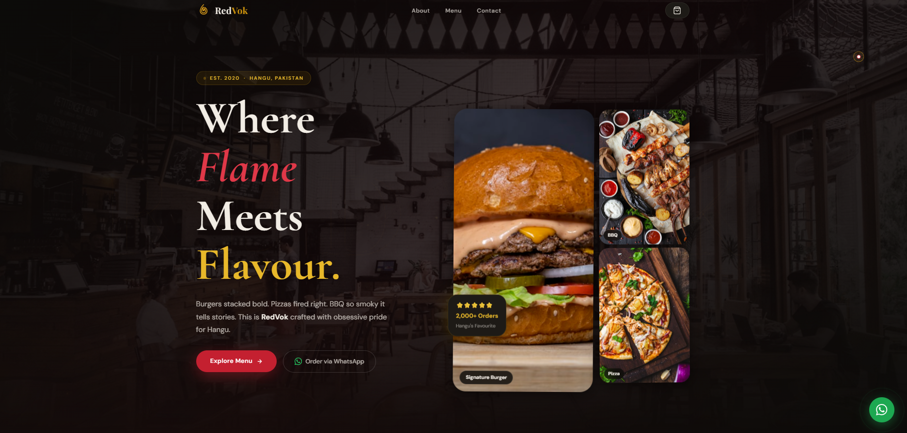
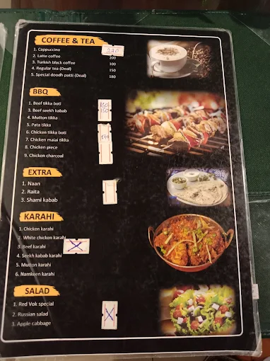

# RedVok Restaurant

A modern, premium landing page for RedVok Restaurant built with HTML, CSS, and JavaScript. The website showcases the restaurant’s menu, ambiance, and ordering experience with a polished dark theme, animated sections, and a WhatsApp-based ordering flow.

## Preview



## Features

- Elegant landing page with a premium restaurant aesthetic
- Smooth scroll animations and interactive UI elements
- Menu section with categorized food items
- Cart drawer with quantity controls and remove option
- Checkout form connected to WhatsApp ordering
- Mobile-friendly responsive layout

## Screenshots



## Tech Stack

- HTML5
- CSS3
- JavaScript (Vanilla)

## Run Locally

1. Open the project folder in your browser, or use a simple local server.
2. Start a local server from the project directory:

   ```bash
   python -m http.server 8000
   ```

3. Open your browser and visit:

   ```text
   http://localhost:8000
   ```

## About

RedVok is designed to provide a stylish and convenient online experience for customers to explore the menu, place orders, and connect directly via WhatsApp.
